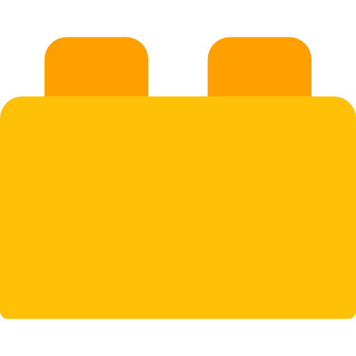

<p align="center">
  
</p>

Lego.ds is an open-source Design System project based on building blocks to create an amazing cross-platform digital experiences.

## Documentation

Lego.ds is documented at [Lego.ds Documentation](https://github.com/victormath12/lego-ds).

## Architecture

Our codebase is a monorepo and individually versioned libraries.
Here's an overview of our packages:

| Package | Version | Size |
| - | - | - |
| [`@lego-ds/components`](/packages/components) | [](https://www.npmjs.com/package/@lego-ds/components) | [](https://bundlephobia.com/result?p=@lego-ds/components) |


## Bootstraping

```sh
git clone [project]
yarn
```

## Staring and lauching all lab-apps

```sh
yarn dev:all
```

This command will launch all lab-apps (Stencil, Angular, Vue, React) in development mode with **hot-reloading enabled**, then you can open in your web browser and start the development, all changes in the **packages/components** will reflect automatcally in all lab-apps. 🚀

| App | Package | Host |
| - | - | - |
| Stencil | packages/components | http://localhost:3003/ |
| React | packages/lab-react | http://localhost:3000/ |
| Vue | packages/lab-vue | http://localhost:3001/ |
| Angular | packages/lab-angular | http://localhost:3002/ |
