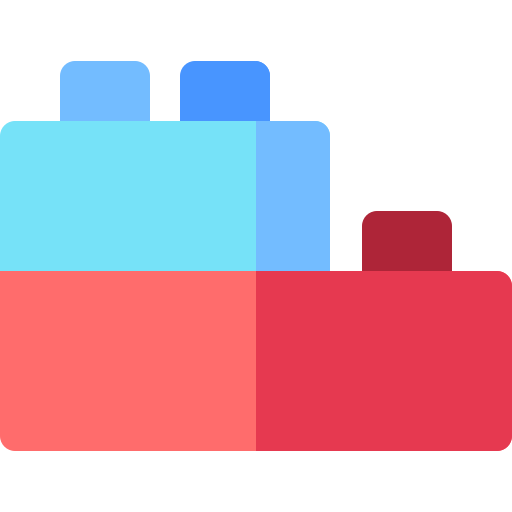

  

Lego.ds is an open-source Design System project based on building blocks to create an amazing cross-platform digital experiences.

## Documentation

Lego.ds is documented at [Lego.ds Documentation](https://github.com/victormath12/lego-ds).

## Architecture

Our codebase is a monorepo and individually versioned libraries.
Here's an overview of our packages:

| Package | Version | Size |
| - | - | - |
| [`@legods/components`](/packages/yoga) |  |  |